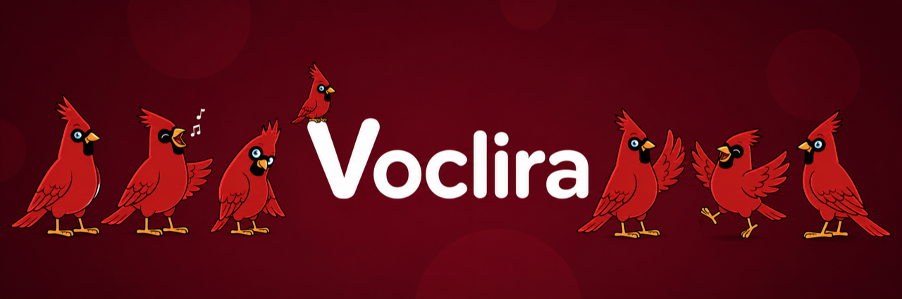
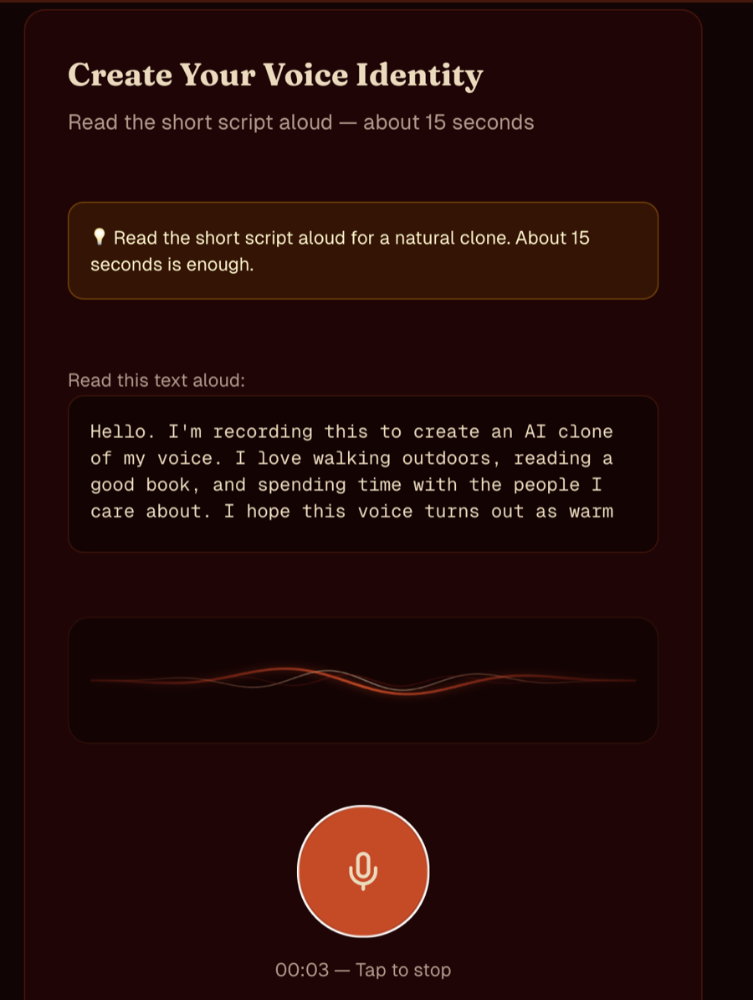
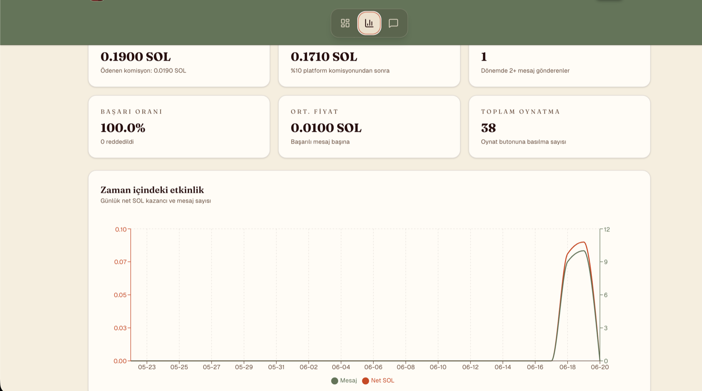

<p align="center">
  
</p>

<h3 align="center">License your voice. Earn while you sleep.</h3>

<p align="center">
  Built on <b>Solana</b> · Powered by <b>Fal.ai Chatterbox</b> (open-source TTS) · Protected by <b>Llama 3.1</b> (Groq)
</p>

<p align="center">
  
  
  
  
  
</p>

---

## Overview

**Voclira** is a Web3 voice licensing platform. Creators record a short voice reference once, set a price in SOL, and earn every time a fan requests a personalized AI-generated voice message through their dedicated Fan Page. A selectable bilingual interface (English & Turkish) sits on top, and every request passes through an AI moderation firewall before any audio is generated.

The voice clone is **zero-shot** — there is no training step or waiting period. A creator records ~15 seconds, and their voice is ready to license instantly.

---

## How It Works

### 🎙 Creator Flow

1. **Record** (or upload) an 8–25s voice reference + a spoken consent statement — zero-shot cloning, no training wait
2. **Set** a price in SOL and your brand-safety filters
3. **Share** your dedicated Fan Page link anywhere

<p align="center">
  
</p>

### 💬 Fan Flow

1. Open the creator's **Fan Page** link
2. Type a message → approve the SOL payment via a connected Phantom wallet
3. The text is screened by the **AI moderation firewall** (&lt;800ms)
4. **Fal.ai Chatterbox** generates audio in the creator's voice (zero-shot, no training step)
5. The fan plays and downloads the generated clip

### 📊 Creator Dashboard & Analytics

Creators track earnings, play counts, success rate, and net SOL over time — with CSV export.

<p align="center">
  
</p>

---

## Tech Stack

| Layer | Technology | Purpose |
|---|---|---|
| Frontend | Next.js 14 (App Router) | Dashboard, Fan/Play views & API routes |
| Blockchain | Solana Devnet | Wallet connections, transactions & payments |
| Voice AI | Fal.ai (Chatterbox, open-source) | Zero-shot voice cloning & text-to-speech |
| Storage | Cloudflare R2 | Reference audio (private) & generated audio (public CDN) |
| Moderation | Llama 3.1 8B (Groq) | Brand-safety AI firewall |
| Database | Supabase (Postgres) | Creator profiles, settings & transaction records |
| Rate Limiting | Upstash Redis | Persistent API rate limiting + one-time sessions |
| Styling | Tailwind CSS | Modern glassmorphism UI |

---

## Architecture

```
[Creator]
    ↓ records voice reference + spoken consent
[R2 private bucket] → voice_profile_object_key stored in Supabase
    ↓
[Fan Page link] → shared on social media

[Fan visits Fan Page]
    ↓ types message + approves SOL
[Solana Transaction] → 90% creator wallet / 10% platform wallet
    ↓
[Llama 3.1 Moderation]
    ├── UNSAFE → transaction fails, request rejected
    └── SAFE → Fal.ai Chatterbox TTS generates audio (zero-shot, signed reference URL)
                    ↓
              Audio copied from Fal's ephemeral URL into the R2 public bucket
                    ↓
              Fan plays audio on the play screen
```

---

## Bilingual Support (TR / EN)

Voclira ships with full bilingual capabilities. Users can switch between English and Turkish on the fly:

- Preference persisted locally via `localStorage` under `voclira_lang`
- Responsive floating glassmorphism `<LanguageToggle />` button
- Comprehensive UI localization across landing, onboarding, analytics charts, settings, dashboard, and playback pages

---

## Getting Started

### Prerequisites

- Node.js 18+
- Solana CLI + Phantom wallet (devnet)
- Fal.ai account & API key (+ account credit for generation)
- Cloudflare R2 — two buckets (public + private) and an API token
- Groq account & API key
- Supabase project
- Upstash Redis database (rate limiting + one-time upload/moderation sessions)

### Installation

```bash
git clone https://github.com/sayweer/voclira
cd voclira
npm install
cp .env.local.example .env.local   # then fill in your keys
npm run dev
```

### Environment Variables

Configure your `.env.local` (see [`.env.local.example`](.env.local.example)):

| Variable | Description | Where to get |
|---|---|---|
| `GROQ_API_KEY` | Groq API key | console.groq.com |
| `FAL_KEY` | Fal.ai API key | fal.ai/dashboard |
| `FAL_CHATTERBOX_TURBO_MODEL` | Fal model id used for EN generation | fal.ai/models (chatterbox/text-to-speech/turbo) |
| `FAL_CHATTERBOX_MULTILINGUAL_MODEL` | Fal model id used for TR generation | fal.ai/models (chatterbox/text-to-speech/multilingual) |
| `R2_ACCOUNT_ID` | Cloudflare account id (builds `R2_ENDPOINT`) | Cloudflare dashboard |
| `R2_ENDPOINT` | `https://<R2_ACCOUNT_ID>.r2.cloudflarestorage.com` | Cloudflare dashboard |
| `R2_ACCESS_KEY_ID` / `R2_SECRET_ACCESS_KEY` | R2 API token | Cloudflare → R2 → Manage API tokens |
| `R2_PUBLIC_BUCKET` | Bucket for fan-generated audio (public) | Cloudflare dashboard |
| `R2_PRIVATE_BUCKET` | Bucket for reference + consent audio (private) | Cloudflare dashboard |
| `R2_PUBLIC_URL` | Public domain/CDN fronting `R2_PUBLIC_BUCKET` | Cloudflare dashboard |
| `CLOUDFLARE_API_TOKEN` / `CLOUDFLARE_ZONE_ID` | Optional — CDN purge on takedown | Cloudflare dashboard |
| `SUPABASE_URL` | Supabase project URL | supabase.com dashboard |
| `SUPABASE_ANON_KEY` | Supabase anon key | supabase.com dashboard |
| `SOLANA_RPC_URL` | Solana devnet RPC endpoint | api.devnet.solana.com |
| `NEXT_PUBLIC_SOLANA_RPC_URL` | Solana RPC endpoint (client-side) | api.devnet.solana.com |
| `NEXT_PUBLIC_SOLANA_NETWORK` | `devnet` or `mainnet-beta` | wallet adapter config |
| `PLATFORM_WALLET` | Platform fee wallet address | Phantom wallet |
| `UPSTASH_REDIS_REST_URL` | Upstash Redis REST URL | console.upstash.com |
| `UPSTASH_REDIS_REST_TOKEN` | Upstash Redis REST token | console.upstash.com |

### Database Setup

Run the SQL script in [`lib/schema.sql`](lib/schema.sql) inside your Supabase SQL editor.

---

## API Reference

Routes marked **(auth)** require `x-wallet-signature` + `x-wallet-nonce` headers (see [Security](#security)) — the signature is never sent in the JSON body.

```
POST /api/upload-url
Body: { walletAddress, type: 'voice-profile' | 'verification-audio' }
Returns a one-time presigned R2 PUT URL + uploadSessionId.

POST /api/moderate
Body: { creatorWallet, buyerWallet, fanText }
Pre-payment moderation check; returns a moderationSessionId consumed by /api/voice/generate.

POST /api/creator/register
Body: { walletAddress, creatorName, priceInLamports, language, uploadSessionId, verificationUploadSessionId, consentTextVersion }
Consumes both one-time upload sessions (reference + consent audio already in R2) and creates the creator.

GET /api/creator/[walletAddress]
Returns creator info by wallet address.

PATCH /api/creator/update-price (auth)
Body: { walletAddress, priceInLamports }

PATCH /api/creator/update-filters (auth)
Body: { walletAddress, blockAdult, blockProfanity, blockPolitical }

PATCH /api/creator/update-license (auth)
Body: { walletAddress, nftMint, txSignature }
Verifies the mint transaction on-chain before persisting nft_mint.

DELETE /api/creator/delete-voice (auth)
Body: { walletAddress }

GET /api/creator/analytics/[walletAddress]?range=7|30|90 (auth)
GET /api/creator/analytics/[walletAddress]/export (auth)

GET /api/creator/license-metadata/[walletAddress]
On-chain metadata JSON for the creator's Voice License NFT.

POST /api/voice/generate
Body: { creatorWallet, fanText, txSignature, buyerWallet, language?, moderationSessionId? }
Re-moderates regardless of moderationSessionId, generates via Fal.ai Chatterbox, uploads to R2.
Returns: { success, audioUrl, durationMs, purchaseId }

POST /api/voice/play/[purchaseId]
Increments play counts for the audio clip.

POST /api/takedown (auth — creator owner or platform admin)
Body: { purchaseId, reason }
Deletes the R2 object, purges the CDN cache, and marks the purchase taken down.
```

---

## Security

- **Wallet signature verification** — all authenticated routes verify `nacl` + `bs58` signatures
- **Replay protection** — single-use nonces in Upstash Redis (5-min TTL), atomically consumed
- **Persistent rate limiting** — Upstash Redis with in-memory fallback
- **Transaction validation** — verifies the buyer's balance decreased by at least the full transferred amount
- **Race-condition safety** — purchases are idempotent (Postgres `unique_violation` reconciliation)
- **Defense in depth** — voice is re-moderated at generation time even when a pre-payment session exists

---

## Known Limitations

- `delete-voice` clears the creator's DB row but does not yet delete the underlying R2 reference/consent audio objects.
- Audio storage is dual-format following the ElevenLabs → Fal.ai/R2 migration: legacy purchases store `audio_url` as raw base64, current ones as an R2 public URL. The frontend handles both transparently via `audioSrcFromStored()`.

---

## ⚠️ Project Status

Voclira currently runs entirely on **Solana devnet** and will stay there for now — so the full roadmap (long-form narration, **audiobooks**, and other planned features) is **not yet available** in production.

Want to try it anyway? Head to **[voclira.xyz](https://voclira.xyz)**, create an account, and bring a voice to life for messages of **up to 300 characters**.

---

## License

© 2026 Voclira — all rights reserved. Published publicly for reference; see [LICENSE](LICENSE) for terms.

<p align="center">
  <br />
  
</p>
